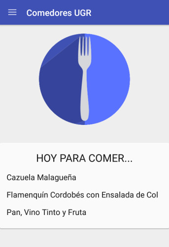
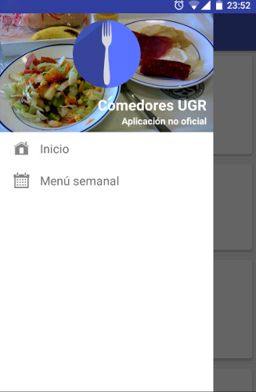
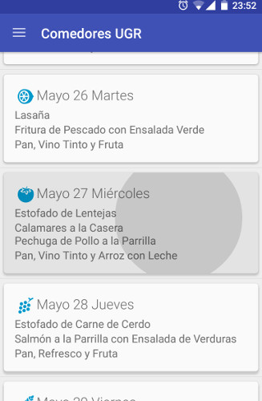
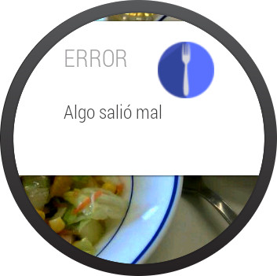

# ComedoresUGR

### No oficial
****

Aplicación Android para consultar los comedores universitarios de la Universidad de Granada.

## Veriones

La aplicación consta de dos versiones:
* Android móvil
* Android Wear

### Android móvil

### Android wear

## Cómo ejecutarla

Necesitarás:

* [Android Studio](https://developer.android.com/sdk/index.html)
* Versión de buildToolS: "22.0.1"
* Para móvil, versión SDK Android mínimo: 14
* Para móvil, versión SDK con el que se compila: 22
* Para wear, versión SDK Android mínimo: 20
* Para wear, versión SDK con el que se compila: 22

Una vez tengas todo esto, solo tendrás que importar el proyecto.

Si no dispones de alguno de los dispositivos y deseas ejecutarlo en un emulador, recuerda añadir ``-dns-server 8.8.8.8,8.8.4.4`` como parámetro (esto permitirá la conexión a Internet de tu emulador, tanto para Android Wear como para Android Móvil)

## Recursos utilizados

* Iconos de [Icons 4 Android](http://icons4android.com/)
* [JSoup](http://jsoup.org/)
